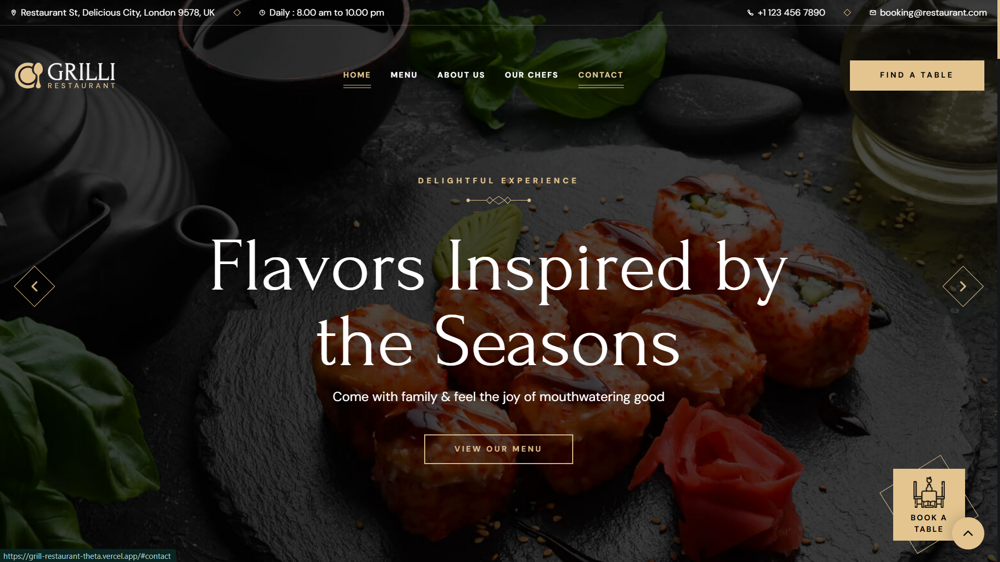
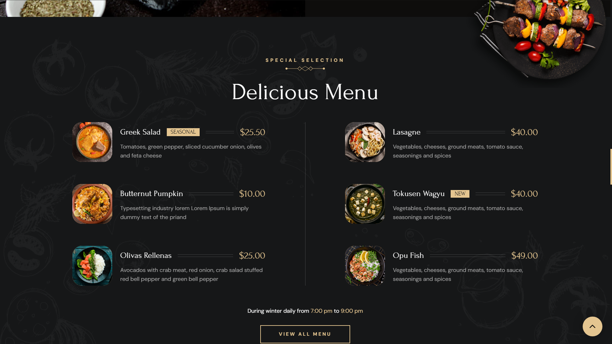
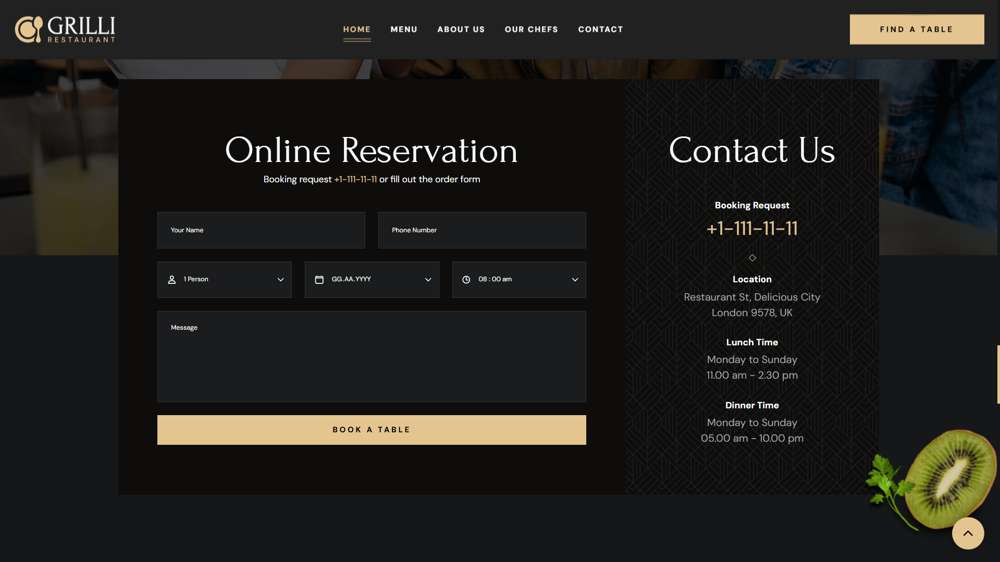
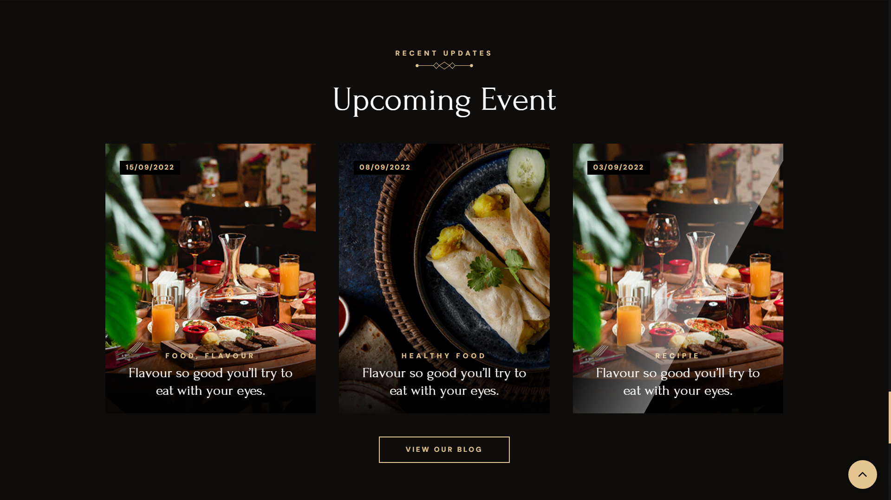
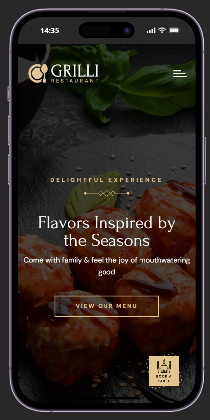
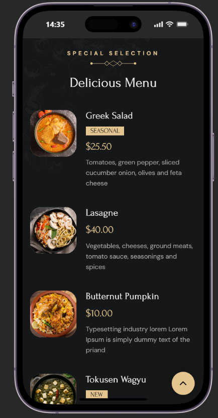
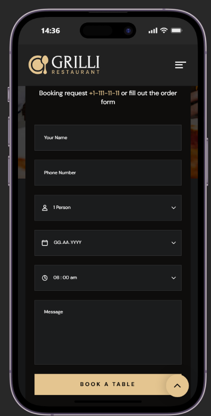
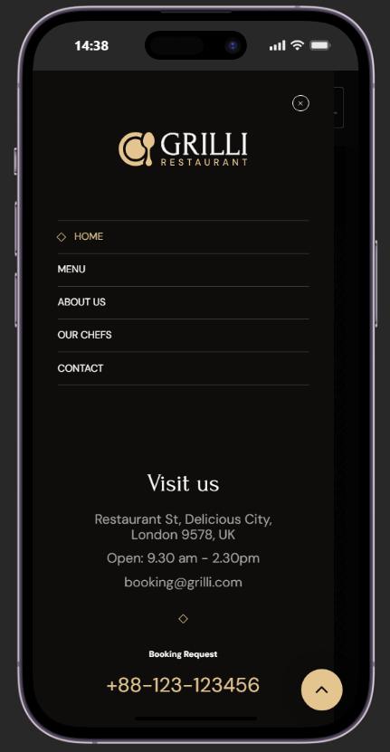

# Grill Restaurant Website

A modern and responsive one-page restaurant website designed for a grill restaurant. 
This project focuses on creating a clean user interface, responsive layout, and smooth user experience across different devices.

## 🌐 Live Demo

https://grill-restaurant-theta.vercel.app/

## 📌 About The Project

Grill Restaurant is a single-page website created to showcase a restaurant brand, menu sections, services, and contact information.

The main goal of this project was to practice building a responsive restaurant landing page with a modern design approach using HTML, CSS, and JavaScript.

## ✨ Features

- Fully responsive design
- Mobile navigation menu
- Smooth scrolling between sections
- Modern restaurant landing page layout
- Custom favicon
- Clean and structured UI
- Optimized for different screen sizes

## 🛠 Technologies Used

- HTML5
- CSS3
- JavaScript
- Git & GitHub
- Vercel

## 📂 Project Structure
Grill-restaurant/
│
├── assets/
├── favicon.svg
├── index.html
├── index.txt
└── style-guide.md

## 🚀 Deployment

This project is deployed using Vercel.

Every update pushed to GitHub is automatically deployed through Vercel.

## 📸 Screenshots

### Desktop Version

  
  
  
  

### Mobile Version

  
  
  
  

## 👨‍💻 Author

DevCaspiaz

GitHub:
https://github.com/DevCaspiaz
